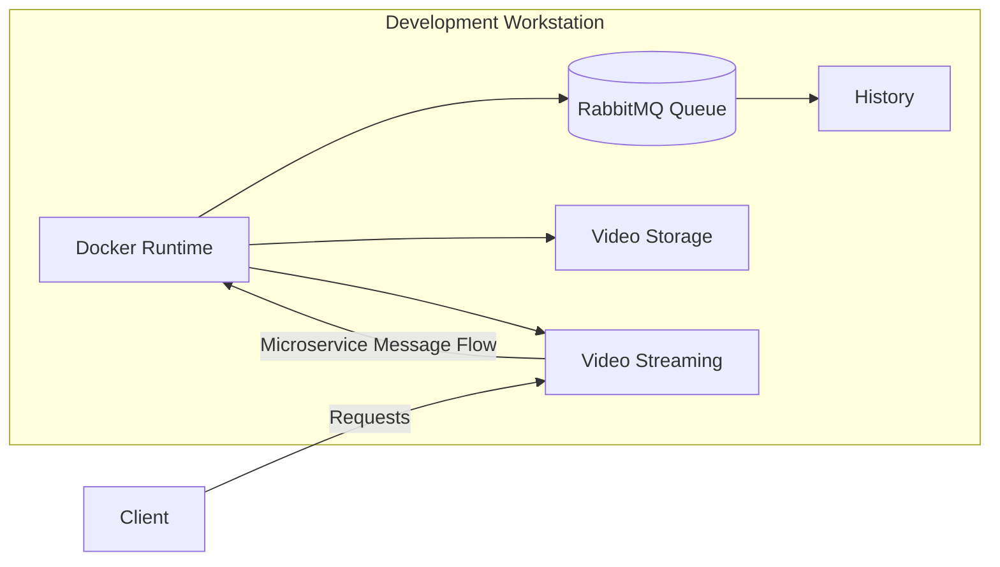

# VideoPlatform

```mermaid
flowchart LR
    subgraph Development_Workstation [Development Workstation]
        Docker_Runtime[Docker Runtime]
        Video_Streaming[Video Streaming]
        Video_Storage[Video Storage]
        RabbitMQ[(RabbitMQ Queue)]
        History[History]

        Docker_Runtime --> RabbitMQ
        Docker_Runtime --> Video_Storage
        Docker_Runtime --> Video_Streaming
        RabbitMQ --> History
    end

    Client[Client] -->|Requests| Video_Streaming
    Video_Streaming -->|Microservice Message Flow| Docker_Runtime
```
