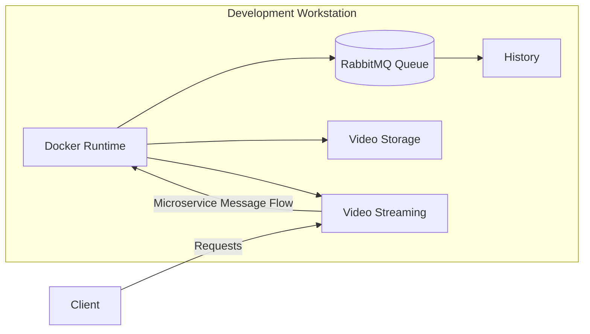

# VideoPlatform



# k8s

## Cluster 배포

infra/cluster 참고

## K8s 인프라

### MongoDB

- pv 생성 (helm/mongo/pv.yaml)
- pvc 생성 (helm/mongo/pvc.yaml)
- helm install mongo bitnami/mongodb -f helm/mongo/values.yaml

```bash
kubectl apply -f helm/mongo/pv.yaml
kubectl apply -f helm/mongo/pvc.yaml
helm install mongo bitnami/mongodb -f helm/mongo/values.yaml
```

**troubleshooting**

- pv / pvc 만들어줘야함
- bitnami/mongodb docker image 가 arm64 지원 안함 -> mongo 이미지로 변경
- 만들어진 pv / pvc 가 노드의 /mnt/data 에 바인드 되는데, 이때 권한때문에 막힘
  - 노드에 직접 접속해서 권한 바꿔주면 됨 (sudo chown -R 1001:1001 /mnt/data/mongo)

### Helm

- helm install 로 워크로드 배포 가능
- helm list 로 배포된 워크로드 확인 가능
- helm status <workload name> 로 워크로드 상세 확인 가능
