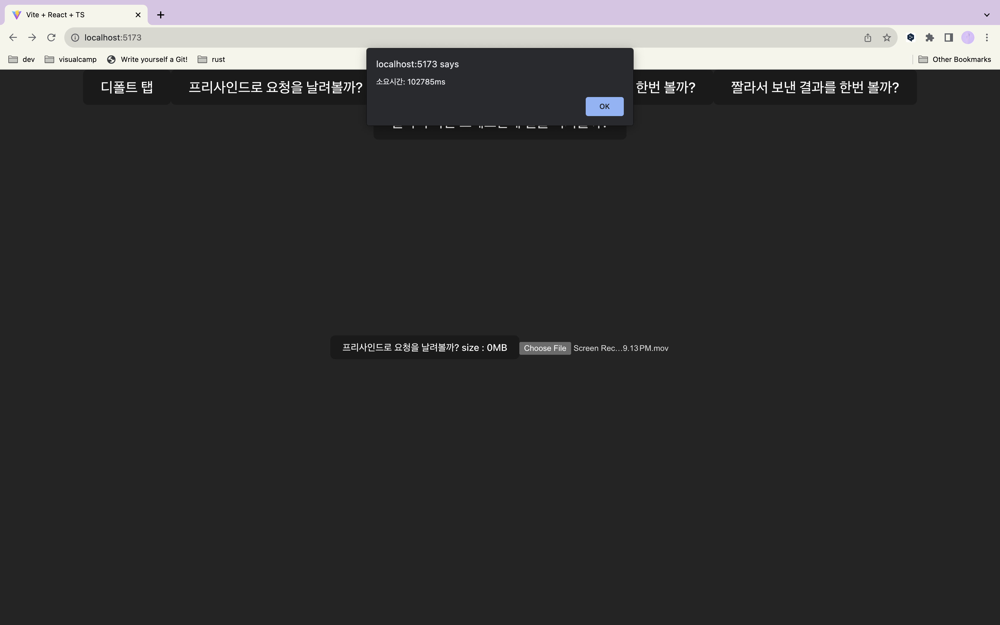
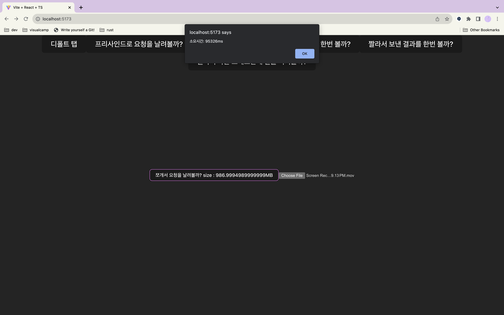

# web-playground

full stack playground

## FE

- React, vite, swc, pnpm
- dev (watch mode) `pnpm i && pnpm dev`
- prod (build & run) `pnpm build && pnpm preview`

## BE

- rust, actix
- `cargo run`
- `cargo watch -x run`
- AWS_BUCKET environment variable is required

# S3 대용량 업로드 퍼포먼스 체크해보기

- 1gb 정도의 파일을 S3 에 올린다. (Korea -> us-east-1)
- 모든 업로드 요청은 presigning 과정을 거친다.

## 방법 1 - 냅다 업로드

### Flow

- 유저 -> browser 파일 업로드
- browser -> server presigned url 요청
- browser -> S3 데이터 전송

### Result

- 100~120 초 정도 소요

## 방법 2 - multipart 로 나눠서 업로드

### Flow

- 유저 -> browser 파일 업로드
- browser -> server upload-id 요청
- browser 에서 파일을 chunking
- 각 upload-id 에 해당하는 presigned url 을 서버에 요청 && 해당 url 에 chunk 를 업로드
- 모든 chunk 가 업로드 된다면, 결과를 모아서 서버에 전송. 서버는 s3 에 업로드 완료를 알림

### Result

- 90 ~ 110 초 정도 소요
- HTTP/1.1 에선 한번에 최대 6개의 TCP 연결만 가능해서([크롬 기준](https://developer.chrome.com/docs/devtools/network/reference/?utm_source=devtools#timing-explanation)), chunking 을 6 의 배수로 하는게 좋을듯.
- 열심히 코드 짠거에 비해 효과가 영... 별로임. 서버에 요청만 늘어남.
- n 개의 chunk 가 있을 때 presignedUrl 을 서버에 n 번 요청해서 받아오는게 아닌, browser 에서 server 에 한번 요청하고, 서버는 s3 에 url 을 n 개 달라고 하는 방법도 있음. (나아질진 몰겟음;;;)

## 방법 3 - multipart 를 사용하며 WebWorker 를 활용한 multithreading

### Flow

- 방법 2와 같은 방식이지만, 6개의 chunk 라면 3 / 3 으로 쪼개서 각각 다른 worker 에게 할당.
- worker 로부터 결과를 모아서 업로드 완료 요청 보내기

### Result

- 90 ~ 110 초 정도 소요
- 생각보다 별 의미가 없음.
- 다른 Thread 로 돌리니, 다른 JOB 을 한다면 의미가 있어질지도...? 몰겠음
