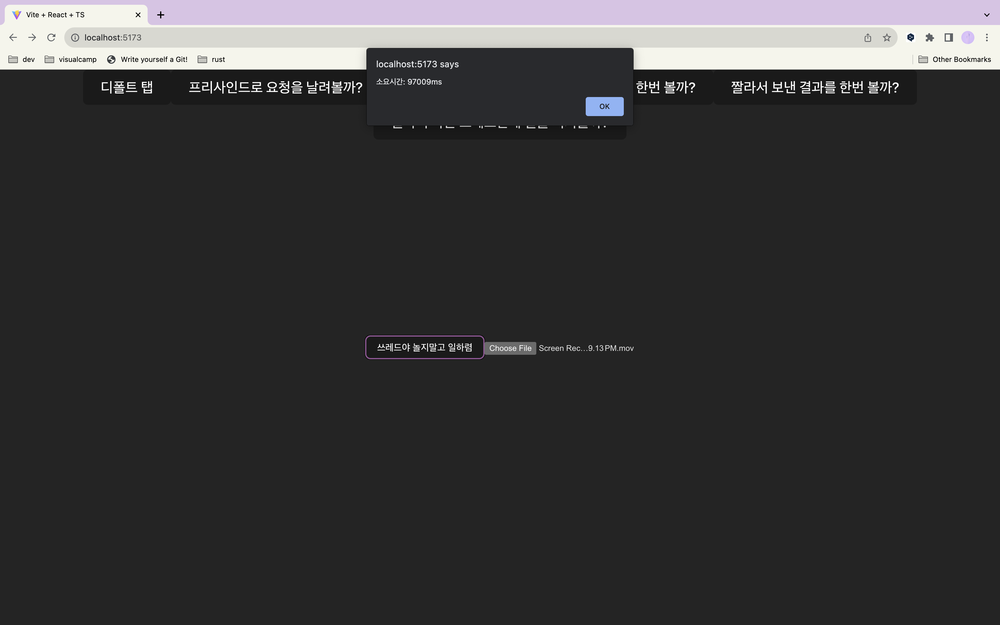

# web-playground

full stack playground

## FE

- React, vite, swc, pnpm
- dev (watch mode) `pnpm i && pnpm dev`
- prod (build & run) `pnpm build && pnpm preview`

## BE

- rust, actix
- `cargo run`
- `cargo watch -x run`
- AWS_BUCKET environment variable is required

# S3 대용량 업로드 퍼포먼스 체크해보기

## TL;DR

**- 다른 네트워크 환경에서 테스트 해봤는데 multipart 가 30% 정도 빠름**

- 1gb 정도의 파일을 S3 에 올린다. (Korea -> us-east-1)
- 모든 업로드 요청은 presigning 과정을 거친다.

## 방법 1 - 냅다 업로드

### Flow

- 유저 -> browser 파일 업로드
- browser -> server presigned url 요청
- browser -> S3 데이터 전송

### Result

- 100~120 초 정도 소요

## 방법 2 - multipart 로 나눠서 업로드

### Flow

- 유저 -> browser 파일 업로드
- browser -> server upload-id 요청
- browser 에서 파일을 chunking
- 각 upload-id 에 해당하는 presigned url 을 서버에 요청 && 해당 url 에 chunk 를 업로드
- 모든 chunk 가 업로드 된다면, 결과를 모아서 서버에 전송. 서버는 s3 에 업로드 완료를 알림

### Result

- 90 ~ 110 초 정도 소요
- HTTP/1.1 에선 한번에 최대 6개의 TCP 연결만 가능해서([크롬 기준](https://developer.chrome.com/docs/devtools/network/reference/?utm_source=devtools#timing-explanation)), chunking 을 6 의 배수로 하는게 좋을듯.
- 열심히 코드 짠거에 비해 효과가 영... 별로임. 서버에 요청만 늘어남.
- n 개의 chunk 가 있을 때 presignedUrl 을 서버에 n 번 요청해서 받아오는게 아닌, browser 에서 server 에 한번 요청하고, 서버는 s3 에 url 을 n 개 달라고 하는 방법도 있음. (나아질진 몰겟음;;;)

## 방법 3 - multipart 를 사용하며 WebWorker 를 활용한 multithreading

### Flow

- 방법 2와 같은 방식이지만, 6개의 chunk 라면 3 / 3 으로 쪼개서 각각 다른 worker 에게 할당.
- worker 로부터 결과를 모아서 업로드 완료 요청 보내기

### Result

- 90 ~ 110 초 정도 소요
- 생각보다 별 의미가 없음.
- 다른 Thread 로 돌리니, 다른 JOB 을 한다면 의미가 있어질지도...? 몰겠음

# 대용량 업로드는 어떻게 할까?

S3 multipart upload 를 사용 (방법 2와 같음)

10GB 파일일때, 단순히 part 를 잘 나눈다고 해결되지 않음.
- part 를 10개로 나누던, 10000개로 나누던 간에 10GB 의 파일을 메모리에 load 해야 하는게 문제.
- 일단 브라우저 limit 는 2BG 정도라 함. `window.performance.memory.jsHeapSizeLimit`
- 차피 virtual memory system 이지 않나? 라 생각했지만 async 로 빠져서 각 작업이 돌아가고 그러면 결국 10GB 가까이를 physical memory 에 올려야 할듯? 그래서 브라우저가 터진거 같음. (heap snapshot 찍어보니 이게 맞음)
- 그러면 chunk 를 10GB / (100MB * 6) 정도로 잡고, 6개씩 업로드 후 메모리 정리되게 하면 가능할듯? lazy 하게 메모리를 올리는거지
- 대충... 1GB 넘으면 <File size> / 100 MB * 6 로 나눠야 하나? 근데 그럼 5MB / 60MB / 1GB 이런 식으로 나뉘는데 좀 킹받네?
- 하나의 로직으로 깔끔하게 chunking 하는 방법이 뭐가 있을까?  chunkingStrategy 이런거... 몰라? 고민해봐야할듯
---
적절한 용량으로 나눠서 6개씩 업로드하면 성공. 여기선 냅다 100MB 로 나눔.
 - snapshot 을 찍어보면, 의도한 대로 메모리를 600MB 정도씩 사용함
 
- 13GB 정도를 업로드 하는데 1300 초 소요. (10MB/s)

- LGTM

- 항상 초당 10MB 정도 업로드 하는거 같으니... 뭐 WebWorker 를 쓴다고 해서 더 나아지지 않을 것 같음. 로직이 아니라 네트워크 속도가 관건임. 당연함.
